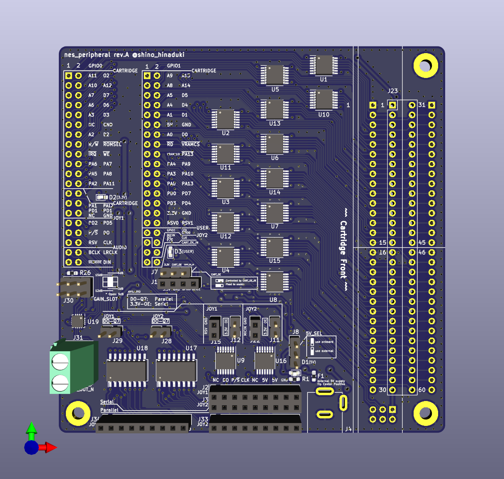
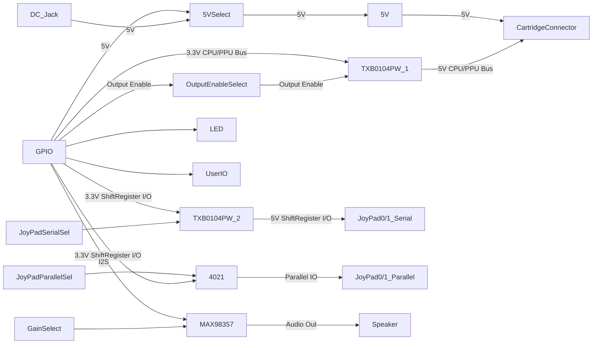

Chisel NES

=======================

## Demo

TODO:

## HDL Design

TODO:

## NES Peripheral EVB for DE0-CV

ファミコンエミュレータを実際のカートリッジで動作させる目的で設計した。

`eda/kicad_6.0.2/nes_peripheral` に、KiCADで設計した基板ファイルがあるので、こちらを参照。

### 機能概要

* DE0-CVのGPIO0,1に直結可能
  * ピンアサインを踏襲していれば、他評価ボード等でも利用可
  * GPIO1からカートリッジとのレベル変換回路をまとめてDisableにすることが可能
* カートリッジとの接続
  * 3.3V - 5V変換付き
  * 周辺にプローブ用ピンも引き出し済
* 純正/互換コントローラ接続
  * 3.3V - 5V変換付き
* 純正回路と同じシフトレジスタICを用いたコントローラ入力
  * 3.3Vでプルアップされた入力回路とGNDを公開
  * 純正/互換コントローラの回路とは切替可
* MAX98537を使ったI2S-音声出力回路
* 5Vの外部供給

### ブロック図

### 回路図

### 部品表

Digikeyで選定した部品を記載。チップコンデンサを始め、サイズ・機能互換であればこれに限らない。また、不要な回路は実装しなくても問題ない
ピンヘッダ、ピンソケットは2.54mm ピッチのものを別途準備すること。

| Ref | Value | 数量 | メーカ製品番号  | url |
| --- | ----  | ---- | --- | ---- |
| C1-C37 |0.1u	| 37 | CL10B104KB8NNWC | https://www.digikey.jp/ja/products/detail/samsung-electro-mechanics/CL10B104KB8NNWC/3887593 |
| C40 | 10p	| 1 | CL10C100CB8NNNC | https://www.digikey.jp/ja/products/detail/samsung-electro-mechanics/CL10C100CB8NNNC/3886727 |
| D1-D3 | LED	| 3 |5988070107F| https://www.digikey.jp/ja/products/detail/dialight/5988070107F/1291269 |
| F1 | Polyfuse_Small	| 1 |0603L300/9SLYR|https://www.digikey.jp/ja/products/detail/littelfuse-inc/0603L300-9SLYR/5427243|
| R1-R22 | 10k	| 22 |RC1608F103CS|https://www.digikey.jp/ja/products/detail/samsung-electro-mechanics/RC1608F103CS/3903493|
| R23	| 0	| 1 |RC0603FR-070RL|https://www.digikey.jp/ja/products/detail/yageo/RC0603FR-070RL/1304008|
| R25, R26 | 100k	| 2 |RC0603JR-07100KL|https://www.digikey.jp/ja/products/detail/yageo/RC0603JR-07100KL/726698|
| U1-U16 | TXB0104PW	| 16 |TXB0104PWR|https://www.digikey.jp/ja/products/detail/texas-instruments/TXB0104PWR/1629102|
| U17, U18 | 4021	| 2 |CD4021BMT|https://www.digikey.jp/ja/products/detail/texas-instruments/CD4021BMT/1690863|
| U19	| MAX98357 | 1 |MAX98357AETE+T|https://www.digikey.jp/ja/products/detail/analog-devices-inc-maxim-integrated/MAX98357AETE-T/4936122|

### 設計データの活用範囲

`eda/kicad_6.0.2/nes_peripheral` にある基板設計データは、 [CC BY-NC 4.0](https://creativecommons.org/licenses/by-nc/4.0/deed) の範囲で利用を許可する。

例えば、本基板の設計データか内容を改変したデータを用い、製造した製品を営利目的で販売する行為は禁止である。
