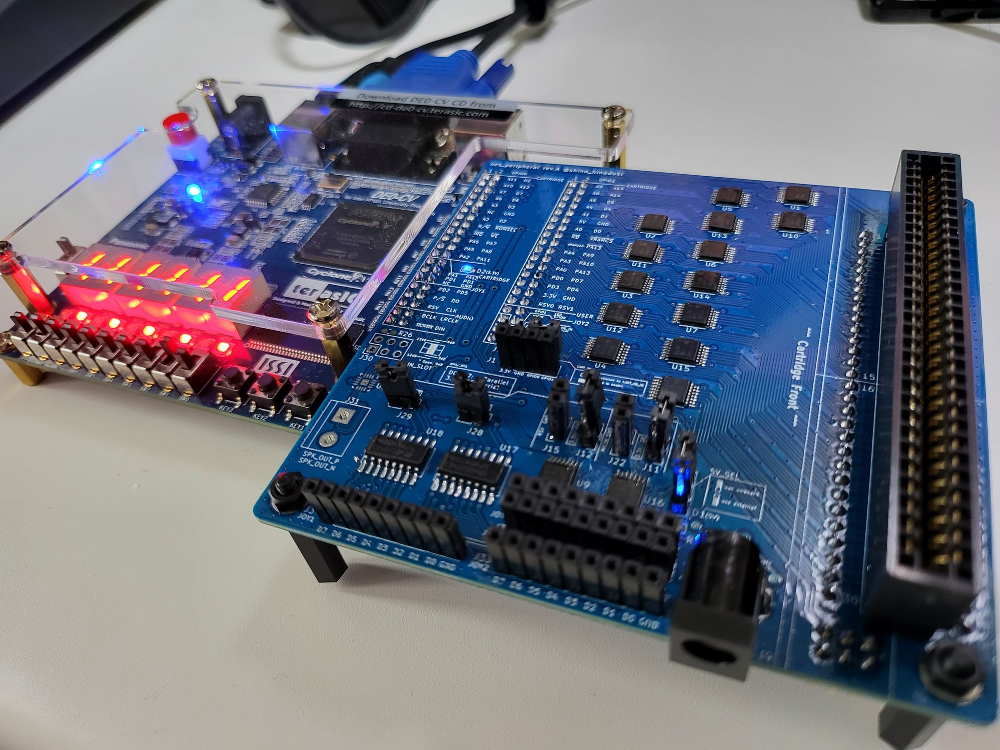
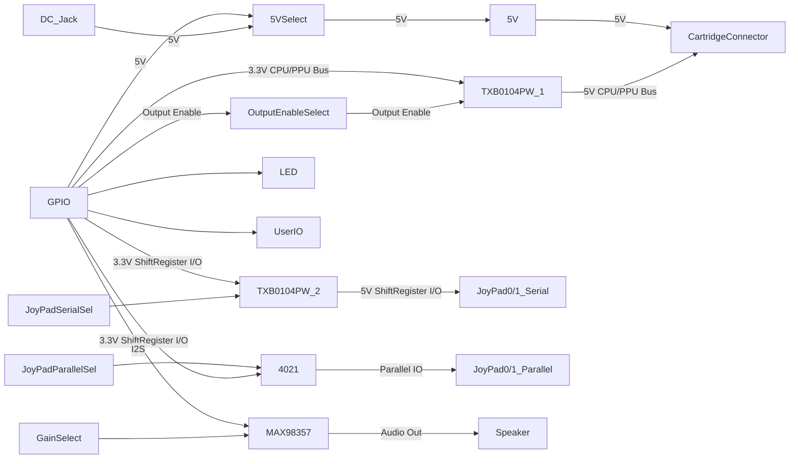

Chisel NES
[](https://github.com/shino-hinaduki/chisel-nes/actions/workflows/test.yml)
=======================

## Demo

TODO:

## HDL Design

TODO:

### 合成手順

#### ChiselNes.v の生成

以下のコマンドでscalaのprojectをビルドして、Chiselから生成したVerilog file  `dst/ChiselNes.v` を得る。

```shell
# sbtが使える環境の場合
$ sbt 'runMain top.ChiselNesDriver --target-dir dst'

# Docker
$ docker-compose run generate
```

#### DE0-CV向けにビルド

`eda/quartusprime_lite_21.1/chisel_nes.qpf` を Quartus Primeで開き、Compile Design を実行して論理合成した後、Program Deviceで書き込む。

(先の手順で生成した `dst/ChiselNes.v` がtop-level design entityに指定されており、プロジェクトにはその他IPや制約ファイルなどが含まれている)

## NES Peripheral EVB for DE0-CV



ファミコンエミュレータを実際のカートリッジで動作させる目的で設計した。

`eda/kicad_6.0.2/nes_peripheral` に、KiCADで設計した基板ファイルがあるので、こちらを参照。

### 機能概要

* DE0-CVのGPIO0,1に直結可能
  * ピンアサインを踏襲していれば、他評価ボード等でも利用可
  * GPIO1からカートリッジとのレベル変換回路をまとめてDisableにすることが可能
* カートリッジとの接続
  * 3.3V - 5V変換付き
  * レベル変換はすべて双方向のため、FPGA側をMaster/Slaveどちらでも利用可能
  * 周辺にプローブ用ピンも引き出し済
* 純正/互換コントローラ接続
  * 3.3V - 5V変換付き
* 純正回路と同じシフトレジスタICを用いたコントローラ入力
  * 3.3Vでプルアップされた入力回路とGNDを公開
  * 純正/互換コントローラの回路とは切替可
* MAX98537を使ったI2S-音声出力回路
* 5Vの外部供給

### ブロック図




### 回路図


### 部品表

Digikeyで選定した部品を記載。チップコンデンサを始め、サイズ・機能互換であればこれに限らない。また、不要な回路は実装しなくても問題ない
ピンヘッダ、ピンソケットは2.54mm ピッチのものを別途準備すること。

| Ref | Value | 数量 | メーカ製品番号  | url |
| --- | ----  | ---- | --- | ---- |
| C1-C37 |0.1u	| 37 | CL10B104KB8NNWC | https://www.digikey.jp/ja/products/detail/samsung-electro-mechanics/CL10B104KB8NNWC/3887593 |
| C40 | 10p	| 1 | CL10C100CB8NNNC | https://www.digikey.jp/ja/products/detail/samsung-electro-mechanics/CL10C100CB8NNNC/3886727 |
| D1-D3 | LED	| 3 |5988070107F| https://www.digikey.jp/ja/products/detail/dialight/5988070107F/1291269 |
| F1 | Polyfuse_Small	| 1 |0603L300/9SLYR|https://www.digikey.jp/ja/products/detail/littelfuse-inc/0603L300-9SLYR/5427243|
| R1-R22 | 10k	| 22 |RC1608F103CS|https://www.digikey.jp/ja/products/detail/samsung-electro-mechanics/RC1608F103CS/3903493|
| R23	| 0	| 1 |RC0603FR-070RL|https://www.digikey.jp/ja/products/detail/yageo/RC0603FR-070RL/1304008|
| R25, R26 | 100k	| 2 |RC0603JR-07100KL|https://www.digikey.jp/ja/products/detail/yageo/RC0603JR-07100KL/726698|
| U1-U16 | TXB0104PW	| 16 |TXB0104PWR|https://www.digikey.jp/ja/products/detail/texas-instruments/TXB0104PWR/1629102|
| U17, U18 | 4021	| 2 |CD4021BMT|https://www.digikey.jp/ja/products/detail/texas-instruments/CD4021BMT/1690863|
| U19	| MAX98357 | 1 |MAX98357AETE+T|https://www.digikey.jp/ja/products/detail/analog-devices-inc-maxim-integrated/MAX98357AETE-T/4936122|


### GPIO Pin Assign

以下のピンアサインになっているためDE0-CVでなくとも利用可能。GPIO0側の5V,3.3Vは利用していない点に注意

#### GPIO0

|Pin#| GPIO#|KiCad SignalName| Description |
|----|------|----------------|-------------|
|  1 |   D0 |3V3_A11         | CPU Bus |
|  2 |   D1 |3V3_O2          | φ2, System Clock |
|  3 |   D2 |3V3_A10         | CPU Bus |
|  4 |   D3 |3V3_A12         | CPU Bus |
|  5 |   D3 |3V3_A7          | CPU Bus |
|  6 |   D5 |3V3_D7          | CPU Bus |
|  7 |   D6 |3V3_A6          | CPU Bus |
|  8 |   D7 |3V3_D6          | CPU Bus |
|  9 |   D8 |3V3_A3          | CPU Bus |
| 10 |   D9 |3V3_D3          | CPU Bus |
| 11 |   5V |NC              | GPIO0側は未使用 |
| 12 |  GND |GND             |  |
| 13 |  D10 |3V3_A2          | CPU Bus |
| 14 |  D11 |3V3_D2          | CPU Bus |
| 15 |  D12 |3V3_R/~W        | CPU Bus |
| 16 |  D13 |3V3_~ROMSEL     | CPU Bus |
| 17 |  D14 |3V3_~IRQ        | CPU Bus |
| 18 |  D15 |3V3_~WE         | PPU Bus |
| 19 |  D16 |3V3_PA6         | PPU Bus |
| 20 |  D17 |3V3_PA7         | PPU Bus |
| 21 |  D18 |3V3_PA5         | PPU Bus |
| 22 |  D19 |3V3_PA8         | PPU Bus |
| 23 |  D20 |3V3_PA2         | PPU Bus |
| 24 |  D21 |3V3_PA11        | PPU Bus |
| 25 |  D22 |3V3_PA1         | PPU Bus |
| 26 |  D23 |3V3_PA12        | PPU Bus |
| 27 |  D24 |3V3_PD1         | PPU Bus |
| 28 |  D25 |3V3_PD6         | PPU Bus |
| 29 | 3.3V |NC              | GPIO0側は未使用 |
| 30 |  GND |GND             |  |
| 31 |  D26 |3V3_PD2         | PPU Bus |
| 32 |  D27 |3V3_PD5         | PPU Bus |
| 33 |  D28 |3V3_JOY1_P/~S   | 1Player Controller |
| 34 |  D29 |3V3_JOY1_DO     | 1Player Controller |
| 35 |  D30 |3V3_JOY1_RSV    | 1Player Controller |
| 36 |  D31 |3V3_JOY1_CLK    | 1Player Controller |
| 37 |  D32 |3V3_I2S_BCLK    | Audio Codec |
| 38 |  D33 |3V3_I2S_LRCLK   | Audio Codec |
| 39 |  D34 |3V3_I2S_~SD_MODE| Audio Codec |
| 40 |  D35 |3V3_I2S_DIN     | Audio Codec |

#### GPIO1

|Pin#| GPIO#|KiCad SignalName| Description |
|----|------|----------------|-------------|
|  1 |   D0 |3V3_A9          | CPU Bus |
|  2 |   D1 |3V3_A13         | CPU Bus |
|  3 |   D2 |3V3_A8          | CPU Bus |
|  4 |   D3 |3V3_A14         | CPU Bus |
|  5 |   D3 |3V3_A5          | CPU Bus |
|  6 |   D5 |3V3_D5          | CPU Bus |
|  7 |   D6 |3V3_A4          | CPU Bus |
|  8 |   D7 |3V3_D4          | CPU Bus |
|  9 |   D8 |3V3_A1          | CPU Bus |
| 10 |   D9 |3V3_D1          | CPU Bus |
| 11 |   5V |BOARD_5V        | J8 CONN_5VSEL次第で使用する |
| 12 |  GND |GND             |  |
| 13 |  D10 |3V3_A0          | CPU Bus |
| 14 |  D11 |3V3_D0          | CPU Bus |
| 15 |  D12 |3V3_~RD         | PPU Bus |
| 16 |  D13 |3V3_~VRAMCS     | PPU Bus |
| 17 |  D14 |3V3_VRAMA10     | PPU Bus |
| 18 |  D15 |3V3_~PA13       | PPU Bus |
| 19 |  D16 |3V3_PA4         | PPU Bus |
| 20 |  D17 |3V3_PA9         | PPU Bus |
| 21 |  D18 |3V3_PA3         | PPU Bus |
| 22 |  D19 |3V3_PA10        | PPU Bus |
| 23 |  D20 |3V3_PA0         | PPU Bus |
| 24 |  D21 |3V3_PA13        | PPU Bus |
| 25 |  D22 |3V3_PD0         | PPU Bus |
| 26 |  D23 |3V3_PD7         | PPU Bus |
| 27 |  D24 |3V3_PD3         | PPU Bus |
| 28 |  D25 |3V3_PD4         | PPU Bus |
| 29 | 3.3V |3.3V            |  |
| 30 |  GND |GND             |  |
| 31 |  D26 |3V3_RSV0        | 5V側で取り出し可能 |
| 32 |  D27 |3V3_RSV1        | 5V側で取り出し可能 |
| 33 |  D28 |USER_GPIO1      | ピンソケットJ1に引き出し済 |
| 34 |  D29 |USER_LED        | OnBoard LED |
| 35 |  D30 |3V3_JOY2_MICIN  | 2Player Controller |
| 36 |  D31 |USER_GPIO0      | ピンソケットJ1に引き出し済 |
| 37 |  D32 |3V3_JOY2_DO     | 2Player Controller |
| 38 |  D33 |3V3_JOY2_CLK    | 2Player Controller |
| 39 |  D34 |3V3_JOY2_P/~S  | 2Player Controller |
| 40 |  D35 |3V3_OE_IN       | Lowの間はレベル変換をHi-Zで切り離せる |


### 設計データの活用範囲

`eda/kicad_6.0.2/nes_peripheral` にある基板設計データは、 [CC BY-NC 4.0](https://creativecommons.org/licenses/by-nc/4.0/deed) の範囲で利用を許可する。

例えば、本基板の設計データか内容を改変したデータを用い、製造した製品を営利目的で販売する行為は禁止である。

